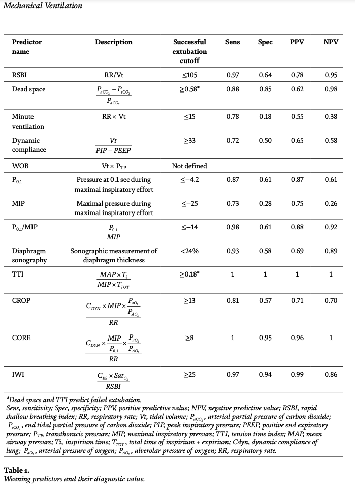

# Ventilator Decision Tree

## Step 1: Monitor Ventilator Parameters
1. Are the parameters normal or abnormal?

### **Branch 1: Normal Parameters**
- **Step 2: Speed Up Weaning Process**
    - **Is original disease controlled or in recovery?**
        - Yes: Move on [1, 5].
    - **Is FiO₂ > 0.4?**
        - Yes: Reduce FiO₂ by 5-10% every 30 minutes to 1 hour until FiO₂ < 0.4.
    - **Is PaO₂/FiO₂ ≤ 260?**
        - Yes: Reduce PaO₂/FiO₂ by 5-10% every 30 minutes to 1 hour until PaO₂/FiO₂ > 260 [1,6].
        - Older resources use PaO₂/FiO₂ = 150 as a cutoff, while later works suggest 260-290 [1,6].
        - For patients who suffer interstitial lung disease (or other chronic hypoxic diseases), a paO2/FiO2 > 120 can be used [1,6,7-9].
    - **Is FiO₂ ≤ 0.4 and PEEP > 5 cm H₂O?**
        - Yes: Reduce PEEP by 1-2 cm H₂O every 1-2 hours until PEEP < 5 cm H₂O [1,6].
    - **Is pH < 7.25?**
        - Yes: Increase pH until pH > 7.25 [1].
        - In patients who suffers from obstructive lung disease, pH and pCO2 should be close to the patient’s baseline level.
    - **Is PEEP ≤ 5 cm H₂O and Pressure Support (PS) > 5 cm H₂O?**
        - Yes: Reduce pressure support by 2 cm H₂O every 1-2 hours, monitoring for WOBpat and RRsp.

    - **Check cardiovascular function: Is patient hemodynamically stable?**
        - Yes: Move on [1,10].

    - **Check neurological status: Is patient alert and cooperative?**
        - Yes: Move on [1,5].
        - **Is patient cooperative?**
            - Yes: Move on [1].
        - **Can patient cough?** 
            - Yes: Move on [11].
    - **Is PS ≤ 5 cm H₂O, FiO₂ < 0.4, and PEEP ≤ 5 cm H₂O?**
        - Yes: Perform Spontaneous Breathing Trial (SBT) and monitor for readiness for extubation.

    **Another Weaning Process Criteria: [37]**
    - Awake and alert when off sedation 
    - Adequate gas exchange
        - FIO2 ≤ 0.50
        - PEEP ≤ 8cmH2O
    - Adequate ventilation 
        - pH > 7.30
    - Adequate hemodynamic status
        - No cardiac ischemia
        - No uncontrolled arrhythmias
        - No or stable, low-dose vasopressor requirement

    **Another Weaning Process Criteria: [38]**
    - The indication for intubation and mechanical ventilation must be resolved
    - The patient has to be able to maintain adequate gas exchange on its own without the help of positive pressure ventilation
    - There must be no auto-PEEP
    - The patient must have an adequate cardiovascular reserve (for example, in heart failure patients in which removing the vent can precipitate new pulmonary edema)
    - There should not be copious amounts of secretions in the ET tube that could generate high airway resistance and obstruction after extubation
    - The patient must be able to protect his or her airway.

    **Weaning Predictors:**

    - **Rapid Shallow Breathing Index (RSBI) = Tidal Volume / Minute Ventilation < 105? (Predictor)**
        - Yes: Consider extubation [1] (80% correlation of extubation success).
        - No: Consider delaying extubation[1] (95% correlation of extubation failure).
    
    -**p/F ratio**
    -**dead space measurement**
    -**minute ventilation**
    -**compliance of respiratory system**
    -**work of breathing**
    -**P0.1 (inspiratory effort at 0.1 seconds inspirium)**
    -**maximal inspiratory pressure (MIP)**
    -**P0.1/MIP**
    -**diaphragmatic sonography**
    -**tension-time index (TTI)**
    -**CROP index**
    -**CORE index**
    -**Weaning Index (WI)**
    -**Integrative Weaning Index (IWI)**
    [14, 19-25].

    

    **Spontaneous Breathing Trial:**
    - **Monitor PaCO₂, SpO₂, FiO₂, and PEEP**:
        - If PaCO₂ < 45 mmHg, FiO₂ < 0.4 [1], and SpO₂ > 90%, continue reducing support.

    - **If SpO₂ drops or PaCO₂ rises during weaning**:
        - Return to previous settings and slow the weaning process.

    - **Has SBT lasted long enough?**:
        - At least 30 min - 2hours [29].

    **Another Way to Determine if SBT is Successful: [37]**
    Although there’s no foolproof method of accurately predicting whether extubation will be successful, making sure that your patient meets all of the following criteria during a SBT will allow you to be right almost all of the time:
    - The patient is awake, alert, and cooperative.
    - The patient’s spontaneous respiratory rate is ≤25 breaths per minute.
    - The patient’s spontaneous tidal volume is ≥300 ml.
    - When asked, the patient is able to significantly increase his/her spontaneous tidal volume.
    
    Blood gas measurements are not routinely needed prior to extubation. I do, however, measure pH and PaCO2 when patients have chronic hypercapnia. I’ve learned the hard way that patients with a rising PaCO2 can look very
    comfortable during an SBT.

    Once a patient has “passed” an SBT, you need to consider a few more issues before proceeding with extubation:
    - Is the patient at risk for post-extubation laryngeal edema?
    - Will the patient be able to effectively clear secretions from the airways following extubation?
    - Does the patient have a “difficult airway” should the need for re-intubation arise?

    **Extubation:**

    - **Is patient stable during SBT?**
        - SpO₂ > 90%?
        - Patient is calm
        - No signs of tachycardia, tachypnea, elevated/decreased blood pressure, desaturation, restlessness, feeling uncomfortable, increased effort in breathing, dia- phoresis, or new complaints such as chest pain.
            - Yes: Move to Extubation.

### **Branch 2: Abnormal Parameters**
- **Step 2: Identify the Abnormality and Take Corrective Action**
    - **Peak Airway Pressure (Ppeak > 30 cm H₂O)**
        - Check for airway obstruction or low lung compliance (Cdyn < 50 mL/cm H₂O).
            - If compliance is low: Increase PEEP by 2-5 cm H₂O.
            - If there is an obstruction: Clear obstruction.
            - If tidal volume is high: Reduce tidal volume by 1-2 mL/kg.
    - **Low Oxygenation (SpO₂ < 90% or PaO₂ < 60 mmHg)**
        - Is FiO₂ > 0.6?
            - Yes: Increase PEEP by 2-5 cm H₂O.
            - No: Increase FiO₂ by 5-10% until SpO₂ > 90% or FiO₂ reaches 0.6.
    - **High CO₂ (PaCO₂ > 45 mmHg or etCO₂ > 50 mmHg)**
        - Is respiratory rate (RR) low (RR < 12)?
            - Yes: Increase RR by 2-4 breaths/min.
            - No: Increase tidal volume by 1-2 mL/kg.
    - **Low CO₂ (PaCO₂ < 35 mmHg or etCO₂ < 30 mmHg)**
        - Is RR high (RR > 30)?
            - Yes: Decrease RR by 2-4 breaths/min.
            - No: Decrease tidal volume by 1-2 mL/kg.
    - **High Work of Breathing (WOBpat > 1.5 J/L or WOBvent > 1.0 J/L)**
        - Is WOBpat high (patient effort)?
            - Yes: Increase pressure support by 2-4 cm H₂O.
        - Is WOBvent high (ventilator effort)?
            - Yes: Decrease pressure support by 2-4 cm H₂O.
    - **Low Dynamic Compliance (Cdyn < 50 mL/cm H₂O)**
        - Increase PEEP by 2-5 cm H₂O to improve lung compliance.
    - **High Inspiratory/Expiratory Resistance (Ri > 15 cm H₂O/L/s or Re > 15 cm H₂O/L/s)**
        - Administer bronchodilator and reassess resistance.
    - **Low Minute Ventilation (MVe < 5 L/min or MVi < 5 L/min)**
        - Is RR low?
            - Yes: Increase RR by 2-4 breaths/min.
            - No: Increase tidal volume by 1-2 mL/kg.
    - **High Leakage (>10%)**
        - Is there a leak in the circuit?
            - Yes: Fix the leak in the circuit or tube.
            - No: Monitor closely and adjust settings as needed.
    - **Backup Ventilation Activated**
        - Investigate cause of apnea or failure to initiate breaths.
        - Call RT if the patient fails to initiate spontaneous breaths.

    **Other Considerations Throughout Weaning:**
    
    - **ARDS Severity [45]**
        - Mild: 200 < PaO2 < 300
        - Moderate: 100 < PaO2 < 200
        - Severe: PaO2 < 100 

**Ventilator Protocols:**
[43]
I. Adult Invasive Ventilation Protocol Initial Parameters and Goals
A. Volume-Ventilation may be used for the majority of patients, but pressure- ventilation (PV or PRVC) should be considered if peak pressures rise over 40 cm H2O or plateau pressures rise >30 cm H2O.
B. Tidal Volume: 4 to 12 mL/Kg of ideal body weight (IBW), while maintaining plateau pressure < 30 cm H2O and delta P < 20 cm H2O.
C. Minute ventilation: 4.0 x BSA (Body Surface Area) = VE (L/min) for males and 3.5 x BSA = VE (L/min) for females adjusted for altitude and body temperature ( DuBois BSA Nomogram) while maintaining plateau pressure < 30 cm H2O and delta P <20 cm H2O.
D. Rate: 8 to 26 breaths/minute adjusted to achieve optimum total cycle time and maintain desired minute ventilation, while maintaining plateau pressure < 30 cm H2O and delta P < 20 cm H2O.
E. FiO2: Initial setting of 0.6 to 0.9 until results from arterial blood gases (ABG) can be obtained and the setting adjusted.
1. Initial ABG should be obtained 15-45 minutes from start of ventilation
2. Pulse oximetry should be correlated with initial ABG and the patient
subsequently monitored with continuous pulse oximetry to maintain SpO2 at or above patient’s normal or >90% SpO2 (Oxygen saturation by pulse oximetry). 3. PEEP 5 to 15 cm H2O. Set initial PEEP at 5 cm H2O, unless otherwise indicated. Higher PEEPs may be required with acute lung injury (ALI) or acute respiratory distress syndrome (ARDS). [Note: See ALI/ARDS Protocol]
F. Pressure Support (PS): 8 to 20 cm H2O. Maintain Pplateau <30 cm H2O and delta P < 20 cm H2O. PS should be adjusted to reduce work of breathing and patient fatigue and support effective ventilation.
G. I:E ratio less than 1:1 (example 1:3). The I:E ratio should be optimized along with total cycle time (TCT) to provide optimum mean airway pressure, lung filling, lung emptying (minimizing air-trapping/Auto-PEEP), patient/ventilator synchrony.
II. Ventilator Adjustments Based on Patient Assessment
A. Initial assessment will be performed within 15-45 minutes from start of ventilation.
B. Assessmentwillincludeevaluationofthepatient’sgeneralappearance,blood pressure, heart rate, breath sounds, ventilating pressures and volumes and arterial blood gases (ABG).
C. Assessmentmayalsoincludeadditionaldata,whenavailable,suchasPetCO2 (end-tidal CO2), SpO2, and hemodynamic data.
D. Adjust the ventilator settings so that ABG results are acceptable.
   Patient Category Normal
Open Heart Patients ARDS*
pH 7.35-7.45
7.35-7.50 7.25-7.45
PaCO2 PaO2 SpO2
   35-45 mmHg
35-50 mmHg Adjust to pH range
> 80 mm Hg
> 65 mm Hg > 60 mmHg
92-97%
90-95% 90-95%
Chronic CO2 Retention
7.30-7.45
45-55 mmHg adjust to pH range
55-75 mmHg
>89%
        *See ALI/ARDS Protocol
E. Ventilator adjustments should be made as follows:
IV.
1. Regular assessment of general appearance, vital signs, breath sounds and hemodynamic stability should be evaluated prior to and during any ventilator adjustments.
2. For a pH < 7.30, evaluate to ensure the cause is respiratory. If appropriate, increase rate to a maximum of 24 breaths/min until pH is > 7.30. If further adjustment is needed increase VT until PIP > 40 cm H2O or Pplateau > 30 cm H2O. If unable to maintain these parameters, consider allowing permissive hypercapnia.
3. For a pH > 7.45, evaluate to ensure the cause is respiratory. If appropriate, reduce rate to a minimum of 8 breaths/minute or until pH is < 7.45. After rate is decreased to 8 breaths/minute, if pH is still > 7.45, reduce volume to a minimum of 4 mL/Kg (IBW).
4. PaO2orSpO2shouldbemaintainedbasedonpatient’stargetedvalues(see table). Hemoglobin should be checked to ensure the absence of anemia. Hemodynamic data should be checked to ensure adequate circulation.
If PaO2/FiO2 ratio is < 300, or, should settings of FiO2 = 0.5 and PEEP = 12 cm H2O be insufficient to maintain an appropriate oxygenation level, an intensivist or pulmonologist should be contact and the ALI/ARDS protocol considered.
Partial Support and Discontinuation of Ventilatory Support
A. Once the problem that resulted in the need for ventilatory support has been resolved, the patient should be considered for reduction of support.
B. Whenassessmentindicatespartialsupportordiscontinuationtobeappropriate, change to a weaning protocol.

**Ventilator Protocols:[39]**
This is why major critical care societies strongly encourage the implementation of protocols for daily sedation interruption and spontaneous breathing trials. However, before a patient is considered for ventilator weaning, the following questions are well worth considering to ensure maximum chances of successful ventilator weaning:

Has the disease process that led to mechanical ventilation resolved or improved?
Is the patient hemodynamically stable? Absence of shock or requirement for pressors or significant arrhythmias
Is the patient adequately oxygenated? (Fraction of inspired oxygen <50% and/or low PEEP requirements)
Is the patient adequately awake and communicative? (absence of encephalopathy, agitation, or overtly altered mental status)

Note that the presence of any of the above parameters doesn't guarantee weaning failure. The opposite also holds true. Because clinical judgment may sometimes over or underestimate a patient's readiness, a need for objective measures exists. Those indices should ideally be easily measurable and widely applicable.

Some suggested indices correlate directly with ventilatory parameters, such as minute ventilation (VE) or vital capacity(VC). Other indices correlate with the degree of oxygen requirements, such as the ratio of arterial to alveolar oxygen ratio (Pao2/PAo2), the ratio of arterial oxygen to the fraction of inspired oxygen (PaO2/FiO2) ratio, or the alveolar-arterial oxygen gradient (A-a gradient). Also, some parameters examine respiratory muscle strength, such as maximal inspiratory pressure (MIP).

There are so many indices because none of them is perfect. There is a wide degree of variability in the performance of the above tests, and their predictive value is far from optimal. The reason being is that these indices only measure one aspect of the respiratory function, while the weaning process is complex and multifactorial.

    -**RSBI**
Defined as the ratio of respiratory rate (f) to tidal volume (VT), initially described by Yang and Tobin 1991. Their trial found that RSBI <105 correlated with weaning success, while a score >105 correlated with weaning failure [42]. The reported sensitivity, specificity, positive predictive value, and negative predictive values were  97, 64, 78, and 95 percent, respectively. Since the initial description, their results were confirmed in multiple subsequent trials, and their test has gained wide popularity and is integrated into ventilator liberation protocols in many ICUs.The test is ideally conducted over 30 minutes while the patient is on minimal pressure support ventilation (PSV) and/or a small PEEP value. 

Diaphragmatic rapid shallow breathing index comprising:

Diaphragmatic excursion rapid shallow breathing index (DE-RSBI)
Respiratory rate [RR]/DE) and the
Diaphragm thickening fraction rapid shallow breathing index (DTF-RSBI, RR/DT showed a higher predictability value compared to RSBI alone.[40,41]

** Ventilator Protocols: University of Toledo**
- https://www.utoledo.edu/coronavirus/docs/UTMC-3364-136-07-09-Ventilator-Management-Protocol-041720.pdf

** Ventilator Protocols: UF Health Shands**
- https://pulmonary.medicine.ufl.edu/files/2019/09/Adult_ventilator_program-11_2018.docx-Final-1.pdf