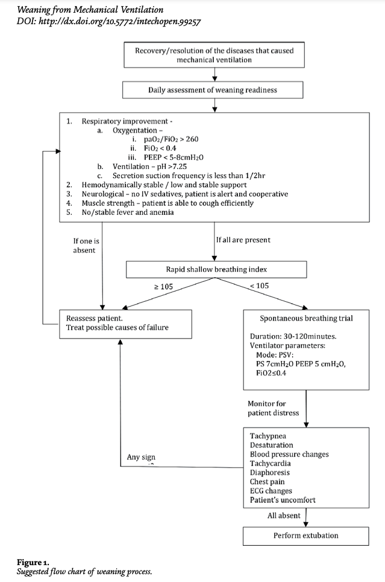

# Criteria for Weaning Readiness

[1]

Before initiating the weaning process from mechanical ventilation, the following criteria must be met to ensure that the patient is ready. These criteria are drawn from various protocols and guidelines to streamline the decision-making process for weaning.

## 1. Cardiovascular Stability
- **Hemodynamic stability:**  
  - No shock, stable or low-dose vasopressor support [1, 10].
  - No signs of active cardiac ischemia [37].
  - No uncontrolled arrhythmias [37].

## 2. Neurological Status
- **Awake and alert:**  
  - Patient should be awake, alert, and cooperative when off sedation [37].
  - No encephalopathy, agitation, or significantly altered mental status [38].

## 3. Respiratory and Gas Exchange
- **Adequate gas exchange:**  
  - **PaO₂/FiO₂ ≥ 260** or patient is able to maintain adequate oxygenation without positive pressure ventilation [1, 6, 38].
  - **FiO₂ ≤ 0.4 to 0.5**: Supplemental oxygen requirement is moderate [1, 38].
  - **PEEP ≤ 5-8 cm H₂O**: PEEP requirement is low to moderate [37].
  - **SpO₂ > 90%** or at patient’s normal oxygen saturation with FiO₂ and PEEP settings as mentioned above [43].

- **Adequate ventilation:**
  - **pH > 7.30**: Patient should have a normal or compensated pH [37, 43].
  - **PaCO₂** at or near baseline for patients with chronic respiratory conditions like COPD [43].

## 4. Ventilator Settings
- **Low ventilatory support required:**  
  - **Pressure support ≤ 5 cm H₂O**, **PEEP ≤ 5 cm H₂O**, and **FiO₂ ≤ 0.4** indicate readiness for Spontaneous Breathing Trial (SBT) [1, 43].

## 5. Musculoskeletal Function
- **Muscle strength and airway protection:**  
  - Patient should be able to cough effectively and protect their airway [11, 38].
  - No excessive secretions that could cause airway obstruction post-extubation [38].

## 6. No Evidence of Auto-PEEP
- **Auto-PEEP:**  
  - There should be no presence of intrinsic (auto) PEEP that could compromise weaning success [38].

## 7. Resolution of Underlying Condition
- **Indication for mechanical ventilation has improved or resolved:**  
  - The original condition that required mechanical ventilation (e.g., pneumonia, ARDS) should be under control or resolved [1, 6, 38].

## 8. Other Considerations:
- **Absence of fever:**  
  - No active infection or fever that could lead to delayed weaning [12].

---

# Issues During the Weaning Process

## 1. Low Oxygenation (SpO₂ < 90% or PaO₂ < 60 mmHg)
- **Possible Causes:**
    - Inadequate FiO₂ or PEEP levels
    - Poor lung compliance
    - Increased airway resistance or obstruction

- **Corrective Actions:**
    - **FiO₂ > 0.6?**  
      - **Yes**: Increase PEEP by 2-5 cm H₂O to improve oxygenation.
      - **No**: Increase FiO₂ by 5-10% until SpO₂ > 90% or FiO₂ reaches 0.6.
    - **Reassess lung compliance**: If compliance is low, increase PEEP [1,6].

---

## 2. Low Minute Ventilation (MVe < 5 L/min or MVi < 5 L/min)
- **Possible Causes:**
    - Low respiratory rate (RR)
    - Low tidal volume (VT)
    - Respiratory muscle fatigue or patient-ventilator asynchrony

- **Corrective Actions:**
    - **Is RR low (RR < 12)?**
      - **Yes**: Increase RR by 2-4 breaths/min to meet minute ventilation requirements.
      - **No**: Increase tidal volume by 1-2 mL/kg to improve minute ventilation [43].
    - **Monitor for patient fatigue or muscle weakness**: If suspected, consider increasing pressure support [43].

---

## 3. High CO₂ (PaCO₂ > 45 mmHg or etCO₂ > 50 mmHg)
- **Possible Causes:**
    - Inadequate ventilation (low RR or VT)
    - Increased airway resistance or obstruction

- **Corrective Actions:**
    - **Is RR low (RR < 12)?**  
      - **Yes**: Increase RR by 2-4 breaths/min.
      - **No**: Increase tidal volume by 1-2 mL/kg to remove more CO₂ [43].

---

## 4. Low CO₂ (PaCO₂ < 35 mmHg or etCO₂ < 30 mmHg)
- **Possible Causes:**
    - Hyperventilation (high RR or VT)
    - Respiratory alkalosis

- **Corrective Actions:**
    - **Is RR high (RR > 30)?**  
      - **Yes**: Decrease RR by 2-4 breaths/min.
      - **No**: Decrease tidal volume by 1-2 mL/kg to correct overventilation [43].

---

## 5. High Peak Airway Pressure (Ppeak > 30 cm H₂O)
- **Possible Causes:**
    - Airway obstruction
    - Low lung compliance (Cdyn < 50 mL/cm H₂O)
    - High tidal volume

- **Corrective Actions:**
    - **Is compliance low?**  
      - **Yes**: Increase PEEP by 2-5 cm H₂O to improve compliance.
    - **Is there an airway obstruction?**  
      - **Yes**: Clear the obstruction.
    - **Is tidal volume high?**  
      - **Yes**: Reduce tidal volume by 1-2 mL/kg [1, 43].

---

## 6. High Work of Breathing (WOBpat > 1.5 J/L or WOBvent > 1.0 J/L)
- **Possible Causes:**
    - Insufficient ventilator support (low PS)
    - Increased patient effort (WOBpat)

- **Corrective Actions:**
    - **Is WOBpat high (patient effort)?**  
      - **Yes**: Increase pressure support by 2-4 cm H₂O.
    - **Is WOBvent high (ventilator effort)?**  
      - **Yes**: Decrease pressure support by 2-4 cm H₂O to avoid overventilation [1].

---

## 7. Low Dynamic Compliance (Cdyn < 50 mL/cm H₂O)
- **Possible Causes:**
    - Reduced lung compliance due to atelectasis or pulmonary edema

- **Corrective Actions:**
    - Increase PEEP by 2-5 cm H₂O to improve lung compliance and reduce airway collapse [43].

---

## 8. High Inspiratory/Expiratory Resistance (Ri > 15 cm H₂O/L/s or Re > 15 cm H₂O/L/s)
- **Possible Causes:**
    - Bronchospasm or airway narrowing
    - Airway obstruction

- **Corrective Actions:**
    - Administer bronchodilator therapy to reduce airway resistance.
    - Reassess inspiratory/expiratory resistance after treatment [43].

---

## 9. High Leakage (>10%)
- **Possible Causes:**
    - Circuit leak or patient-ventilator interface issue

- **Corrective Actions:**
    - **Is there a leak in the circuit?**  
      - **Yes**: Fix the leak in the circuit or tube.
    - **No**: Monitor closely and adjust ventilator settings as needed [43].

---

## 10. Backup Ventilation Activated
- **Possible Causes:**
    - Apnea or failure to initiate spontaneous breaths
    - Ventilator circuit malfunction

- **Corrective Actions:**
    - Investigate the cause of apnea or failure to initiate breaths.
    - Call respiratory therapist (RT) if the patient fails to initiate spontaneous breaths [43].

---

## 11. ARDS Severity
- **Severity Classification: [45]**
    - Mild: PaO₂ between 200 and 300 mmHg, Mortality 27%
    - Moderate: PaO₂ between 100 and 200 mmHg, Mortality 32%
    - Severe: PaO₂ < 100 mmHg, Mortality 45%

- **Corrective Actions:**
    - Adjust FiO₂ and PEEP according to ARDS severity.  
      - For moderate to severe ARDS, use high PEEP strategies to maintain oxygenation [43].

---

# Summary of Ventilator Protocol Adjustments Before Weaning

- **Tidal Volume:** 4-12 mL/kg of ideal body weight while maintaining plateau pressure < 30 cm H₂O [43].
- **PEEP:** Set to 5-15 cm H₂O, with higher PEEP for conditions like ARDS if necessary [43].
- **Pressure Support:** Typically set to 8-20 cm H₂O to reduce patient work of breathing, while keeping the plateau pressure < 30 cm H₂O [43].
- **Respiratory Rate:** 8-26 breaths/min, adjusted based on the patient's needs and target minute ventilation [43].

---

# Weaning Process (Assuming No Issues)

The weaning process involves a gradual reduction in ventilator support while monitoring the patient for readiness to breathe independently. This guide outlines the step-by-step process when there are no issues, such as low oxygenation, high CO₂, or patient instability.

---

## Step 1: Assess Readiness for Weaning
Before starting the weaning process, ensure the following criteria are met:

- **Cardiovascular Stability**:  
  - The patient is hemodynamically stable with no signs of shock or active cardiac ischemia. 
  - No significant arrhythmias or requirement for vasopressors [1,10].

- **Neurological Status**:  
  - The patient is awake, alert, and cooperative, with no significant encephalopathy or agitation [37,38].

- **Respiratory and Gas Exchange Stability**:  
  - PaO₂/FiO₂ ratio ≥ 260.
  - FiO₂ ≤ 0.4-0.5. 
  - PEEP ≤ 5-8 cm H₂O.
  - pH > 7.30 (normal or compensated pH).
  - PaCO₂ at or near baseline for patients with chronic respiratory conditions like COPD [1,6,38,43].

- **Ventilator Settings**:  
  - Pressure support ≤ 5 cm H₂O, FiO₂ ≤ 0.4, and PEEP ≤ 5 cm H₂O, indicating readiness for a Spontaneous Breathing Trial (SBT) [1,43].

- **Musculoskeletal Function**:  
  - The patient can cough effectively and protect their airway, with no excessive secretions [11,38].

- **Absence of Auto-PEEP**:  
  - Ensure there is no intrinsic PEEP that could compromise weaning success [38].

- **Resolution of Underlying Condition**:  
  - The condition that required mechanical ventilation (e.g., pneumonia, ARDS) is either resolved or under control [1,6,38].

---

## Step 2: Spontaneous Breathing Trial (SBT)
Once the patient is deemed ready for weaning, initiate an SBT. The SBT evaluates the patient’s ability to breathe independently with minimal ventilatory support.

- **Ventilator Settings for SBT**:  
  - Pressure Support (PS): 5-7 cm H₂O.
  - PEEP: 5 cm H₂O.
  - FiO₂: ≤ 0.4 [1,6].

- **Monitoring During SBT**:
    - Ensure **PaCO₂ < 45 mmHg**, FiO₂ < 0.4, and **SpO₂ > 90%** [1,6].
    - Observe the patient for signs of distress, such as:
        - Tachypnea (rapid breathing)
        - Desaturation (SpO₂ < 90%)
        - Tachycardia (elevated heart rate)
        - Diaphoresis (excessive sweating)
        - Chest pain, discomfort, or ECG changes
        - Elevated or decreased blood pressure

- **Duration of SBT**:  
  - At least 30 minutes, up to 120 minutes [29].
  - The SBT should be stopped early if there are any signs of distress or failure.

---

## Step 3: Evaluate SBT Results
At the end of the SBT, evaluate the patient’s performance and readiness for extubation:

- **Success Criteria**:  
  - SpO₂ remains > 90%.
  - PaCO₂ is within acceptable limits.
  - The patient is calm, with no signs of respiratory distress (e.g., tachypnea, desaturation, discomfort) [37].

- **Additional Considerations**:  
  - Is the patient at risk for post-extubation complications (e.g., laryngeal edema)?
  - Can the patient effectively clear secretions post-extubation?
  - Does the patient have a "difficult airway" that may require careful monitoring in case of re-intubation?

---

## Step 4: Extubation
If the SBT is successful and the patient meets all criteria for extubation, proceed with removing the endotracheal tube.

- **Ensure**:
  - The patient remains hemodynamically stable.
  - No signs of respiratory fatigue or distress during the extubation process.

- **Post-Extubation Monitoring**:
  - Closely monitor the patient’s SpO₂, respiratory rate, and PaCO₂ after extubation to ensure they continue to breathe effectively without support.
  - Be alert for signs of airway obstruction, secretions, or laryngeal edema.

---

## Step 5: Post-Weaning Management
After successful extubation, manage the patient’s respiratory care with appropriate oxygen support and monitoring. This may include:

- **Supplemental Oxygen**:  
  - Nasal cannula or face mask to maintain SpO₂ > 90%.
  
- **Non-Invasive Ventilation (NIV)**:  
  - If there is a risk of post-extubation respiratory failure, consider using NIV as a bridge to full respiratory independence [33,34,35].

- **Further Weaning Considerations**:
  - Continue to monitor the patient’s neurological, cardiovascular, and respiratory status to ensure stability.
  - Address any remaining issues such as muscle strength, cough effectiveness, and airway protection [38].

---

This process assumes that no issues such as low oxygenation, high CO₂, or airway complications occur during weaning. Continuous monitoring and timely intervention remain critical throughout this procedure.

---

## Predictors of Weaning Success [14, 19-25]

Several clinical and ventilatory parameters are used to predict the success of weaning from mechanical ventilation. These predictors help clinicians determine whether a patient is ready for extubation or if further support is needed.

### 1. **Rapid Shallow Breathing Index (RSBI)**  
   - **Formula**: RSBI = Respiratory Rate (RR) / Tidal Volume (VT)  
   - **Cutoff for Success**: RSBI < 105 is associated with a high likelihood of successful extubation.  
   - **Sensitivity**: 97%  
   - **Specificity**: 64%  
   - **Positive Predictive Value (PPV)**: 78%  
   - **Negative Predictive Value (NPV)**: 95%  
   - **Clinical Use**: RSBI is one of the most widely used predictors of extubation success. An RSBI > 105 suggests a higher risk of extubation failure [1, 14, 19].

### 2. **Minute Ventilation (VE)**  
   - **Cutoff for Success**: VE ≤ 15 L/min  
   - **Clinical Use**: High minute ventilation may indicate increased work of breathing, which can lead to extubation failure. A lower VE is a favorable indicator of extubation readiness [19].

### 3. **Dynamic Compliance (Cdyn)**  
   - **Formula**: Cdyn = VT / (PIP - PEEP)  
   - **Cutoff for Success**: Cdyn ≥ 33 mL/cm H₂O is associated with successful weaning.  
   - **Clinical Use**: Higher dynamic compliance suggests better lung mechanics and reduced resistance to ventilation, which increases the likelihood of successful extubation [19, 20].

### 4. **Work of Breathing (WOB)**  
   - **Formula**: WOB = Tidal Volume (VT) / Transpulmonary Pressure (PTP)  
   - **Cutoff for Success**: Not definitively established for all patients.  
   - **Clinical Use**: Increased work of breathing, especially when caused by patient effort (WOBpat), can be a sign that the patient is not ready to be extubated. A lower WOB is favorable for weaning success [19].

### 5. **P0.1 (Airway Occlusion Pressure at 0.1 seconds)**  
   - **Cutoff for Success**: P0.1 ≤ -4.2 cm H₂O is associated with successful weaning.  
   - **Sensitivity**: 87%  
   - **Specificity**: 61%  
   - **Clinical Use**: P0.1 measures the effort of inspiration and indicates respiratory drive. A high P0.1 suggests excessive respiratory effort and may predict extubation failure [19, 20].

### 6. **Maximal Inspiratory Pressure (MIP)**  
   - **Cutoff for Success**: MIP ≤ -25 cm H₂O  
   - **Sensitivity**: 73%  
   - **Specificity**: 28%  
   - **Clinical Use**: MIP measures the strength of the respiratory muscles. A higher MIP indicates stronger inspiratory muscles, which is a good predictor of successful extubation [20].

### 7. **P0.1 / MIP Ratio**  
   - **Cutoff for Success**: P0.1 / MIP ≤ -14  
   - **Sensitivity**: 98%  
   - **Specificity**: 61%  
   - **Clinical Use**: The P0.1 / MIP ratio is a comprehensive measure of both respiratory drive and muscle strength. A lower ratio predicts a better chance of weaning success [20].

### 8. **Diaphragmatic Sonography (Thickness)**  
   - **Cutoff for Success**: Diaphragm thickness < 24%  
   - **Sensitivity**: 93%  
   - **Specificity**: 58%  
   - **Clinical Use**: Diaphragmatic sonography can be used to assess diaphragm function. Thinning of the diaphragm is associated with muscle atrophy and poorer weaning outcomes. Higher diaphragmatic thickness indicates better weaning success [19, 23].

### 9. **Tension-Time Index (TTI)**  
   - **Formula**: TTI = (MAP × Ti) / (MIP × Ttot)  
   - **Cutoff for Success**: TTI ≤ 0.18  
   - **Sensitivity**: 100%  
   - **Specificity**: 100%  
   - **Clinical Use**: TTI evaluates the tension and time load on the respiratory muscles. A lower TTI is a strong predictor of weaning success and respiratory muscle endurance [20].

### 10. **CROP Index**  
   - **Formula**: Cdyn × MIP × (PaO₂ / PAO₂) / RR  
   - **Cutoff for Success**: CROP ≥ 13 is predictive of weaning success.  
   - **Clinical Use**: The CROP index incorporates lung mechanics, gas exchange, and respiratory muscle strength. A higher CROP index suggests a higher likelihood of successful extubation [20].

### 11. **CORE Index**  
   - **Formula**: Cdyn × MIP × (PaO₂ / PAO₂) / P0.1 × RR  
   - **Cutoff for Success**: CORE ≥ 8  
   - **Sensitivity**: 100%  
   - **Specificity**: 95%  
   - **Clinical Use**: The CORE index is a more comprehensive predictor that includes compliance, respiratory effort, and oxygenation. A higher score indicates a better chance of successful weaning [20, 23].

### 12. **Integrative Weaning Index (IWI)**  
   - **Formula**: Cstatic × SpO₂ / RSBI  
   - **Cutoff for Success**: IWI ≥ 25  
   - **Sensitivity**: 97%  
   - **Specificity**: 94%  
   - **Clinical Use**: The IWI is a composite measure of lung compliance, oxygenation, and respiratory drive. A higher IWI is strongly correlated with successful extubation [21].

---

These predictors provide clinicians with a multifactorial approach to assess a patient’s readiness for weaning. Utilizing multiple predictors, such as RSBI, dynamic compliance, and diaphragm function, can increase the likelihood of extubation success.

---

# Spontaneous Breathing Trial (SBT)

The Spontaneous Breathing Trial (SBT) is one of the most important steps in assessing a patient's readiness for extubation. It tests the patient's ability to breathe independently with minimal ventilatory support and helps clinicians determine whether the patient can safely be removed from the ventilator.

## SBT Criteria for Initiation

Before initiating an SBT, the following clinical and ventilator criteria should be met:

- **FiO₂ ≤ 0.5**:  
  The fraction of inspired oxygen (FiO₂) should be low enough to ensure that the patient can maintain acceptable oxygenation levels without excessive support [1, 5, 38].
  
- **PEEP ≤ 5-8 cm H₂O**:  
  The patient should be on a low level of positive end-expiratory pressure (PEEP) to confirm they can maintain lung function without high pressure support [1, 6, 38].
  
- **Pressure Support ≤ 5-7 cm H₂O**:  
  Pressure support should be minimal, generally between 5 and 7 cm H₂O, to evaluate the patient’s ability to initiate breaths with minimal assistance [1, 43].
  
- **SpO₂ ≥ 90% on FiO₂ ≤ 0.4**:  
  The patient should maintain a blood oxygen saturation (SpO₂) of 90% or higher on a FiO₂ of 0.4 or less [1, 43].
  
- **Stable Hemodynamics**:  
  No significant cardiovascular instability, such as hypotension requiring vasopressors or signs of shock [37, 38].

- **Patient Alertness**:  
  The patient should be awake, alert, and cooperative with a Glasgow Coma Score (GCS) > 8, with no significant encephalopathy or excessive sedation [37, 38].

---

## SBT Procedure

Once the patient meets the criteria for an SBT, the following ventilator settings and monitoring parameters are used during the trial:

- **Ventilator Settings**:
    - **Pressure Support (PS)**: 5-7 cm H₂O
    - **PEEP**: 5 cm H₂O
    - **FiO₂**: ≤ 0.4 (usually adjusted to maintain SpO₂ > 90%)
    - **Duration**: At least 30 minutes to a maximum of 120 minutes, depending on patient tolerance and clinical stability [1, 6, 29, 43].

- **Monitoring**:  
  The patient's respiratory effort and overall stability should be closely monitored during the SBT. Important parameters to observe include:
    - **Respiratory Rate (RR)**: Should remain ≤ 35 breaths/min [43].
    - **Tidal Volume (VT)**: Tidal volume should be ≥ 300 mL.
    - **Heart Rate**: Monitor for significant changes (tachycardia > 120 bpm may indicate distress).
    - **SpO₂**: Oxygen saturation should remain ≥ 90% throughout the trial.
    - **PaCO₂**: Ensure PaCO₂ remains stable without significant hypercapnia (PaCO₂ ≤ 45 mmHg is ideal) [1, 6, 38].
    - **Blood Pressure**: Watch for hypotension or hypertension as signs of cardiovascular instability.
  
- **Signs of Distress During SBT**:  
  The trial should be stopped immediately if any of the following signs of distress are observed:
    - **Tachypnea**: Respiratory rate > 35 breaths/min.
    - **Desaturation**: SpO₂ < 90%.
    - **Tachycardia**: Heart rate > 120 bpm.
    - **Increased Work of Breathing (WOB)**: Visible signs of respiratory muscle fatigue (e.g., use of accessory muscles, paradoxical breathing).
    - **Hemodynamic Instability**: Significant changes in blood pressure, such as hypotension or hypertension.
    - **Patient Discomfort**: Any reported discomfort or signs of agitation [1, 6, 29, 37].

---

## Evaluation of SBT Results

After the SBT is completed, evaluate the patient’s performance to determine if they are ready for extubation. A successful SBT is characterized by the following:

- **SpO₂ ≥ 90%**: The patient should maintain adequate oxygen saturation on minimal ventilator support (FiO₂ ≤ 0.4).
- **PaCO₂ ≤ 45 mmHg**: No significant rise in PaCO₂, indicating that the patient can maintain adequate ventilation [1].
- **Stable Respiratory Rate**: The respiratory rate should remain ≤ 35 breaths/min without signs of respiratory distress.
- **No Tachycardia or Hemodynamic Instability**: Heart rate should remain below 120 bpm, and blood pressure should remain stable [29, 37].
- **Patient Comfort**: The patient should be comfortable, without signs of distress or fatigue [1, 29].

If the SBT is successful and all criteria are met, the patient is considered ready for extubation.

---

## Considerations Before Extubation

Even after a successful SBT, several additional considerations should be evaluated before extubation:

- **Laryngeal Edema Risk**: Assess for the risk of post-extubation laryngeal edema, especially in patients with prolonged intubation.
- **Secretions**: Ensure the patient can effectively manage secretions and protect their airway post-extubation [37, 38].
- **Difficult Airway**: If the patient has a difficult airway, ensure appropriate measures are in place in case re-intubation is required [37].

---

The SBT is an essential tool for evaluating a patient’s ability to breathe independently and should be performed with careful monitoring. Successful completion of the trial is a strong indicator that the patient is ready for extubation, provided that all other weaning criteria are met.
