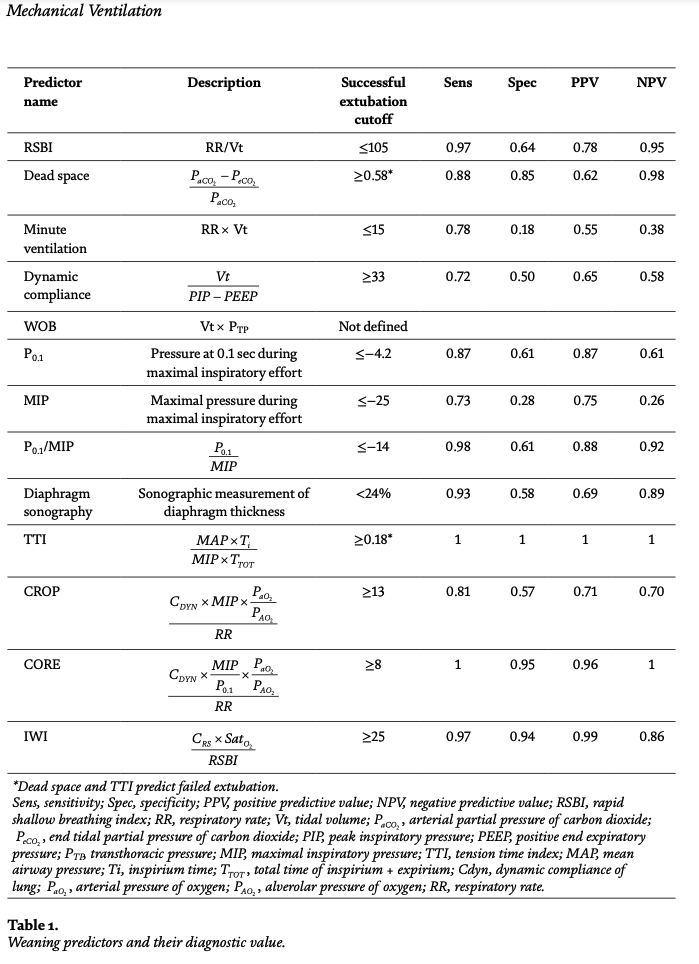

# Weaning Process Parameter Ranges

| **Variable**            | **Error Low** | **Warning Low** | **Normal Range**       | **Warning High**      | **Error High**     | **References**    |
|-------------------------|---------------|-----------------|------------------------|-----------------------|--------------------|-------------------|
| **PaO₂/FiO₂ Ratio**      |               | < 120 (Interstitial Lung Disease)     | < 150, 260-290                  |       |                    | [1, 6, 9, 38]         |
| **SpO₂/FiO₂ Ratio**      |               |      |                  |   Correlation(R=0.603) with PaO₂/FiO₂ Ratio   |                    |          | [46]
| **FiO₂**                |               | > 0.5           | ≤ 0.4 - 0.5            | 0.4 - 0.6             | > 0.6              | [1, 38, 43]        |
| **PEEP**                |               | > 5-8 cm H₂O    | ≤ 5-8 cm H₂O           | > 8-12 cm H₂O         |                    | [1, 37, 43]        |
| **SpO₂**                | < 90%         | 90%             | > 90%                  |                       |                    | [43]               |
| **pH**                  | < 7.25        | 7.25 - 7.30     | > 7.30                 |                       |                    | [37, 43]           |
| **PaCO₂**               |               |                 | Near baseline (COPD)   | > 45 mmHg             | > 50 mmHg          | [43]               |
| **Pressure Support (PS)**|               | > 5-7/8 cm H₂O    | ≤ 5-7/8 cm H₂O           |                       |                    | [1, 43]            |
| **Tidal Volume (VT)**    |               |                 | ≥ 300 mL               |                       |                    | [1, 6, 43]         |
| **Minute Ventilation (VE)** | < 5 L/min   |                 | ≤ 15 L/min             |                       |                    | [19, 43]           |
| **Peak Airway Pressure (Ppeak)** |       |                 |                        | > 30 cm H₂O           |                    | [1, 43]            |
| **Dynamic Compliance (Cdyn)** |          |                 | ≥ 33 mL/cm H₂O         | < 50 mL/cm H₂O        |                    | [19, 20]           |
| **Work of Breathing (WOB)** |            |                 |                        | WOBpat > 1.5 J/L      | WOBvent > 1.0 J/L  | [1, 43]            |
| **Peak Expiratory Flow** |            |       <60 L/min (unsafe for extubaiton [29]          |                        |           |       | [1, 43]            |
| **Inspiratory/Expiratory Resistance (Ri/Re)** | |           |                        | Ri > 15 cm H₂O/L/s    | Re > 15 cm H₂O/L/s | [43]               |
| **Leakage**             |               |                 | ≤ 10%                  |                       | > 10%              | [43]               |

# Weaning Predictors

**References:**

- [1] Statlender L, Singer P. "Weaning from Mechanical Ventilation." IntechOpen, 2021.
- [6] Wu Y-K, Kao K-C, Hsu K-H, Hsieh M-J, Tsai Y-H. "Predictors of Successful Weaning from Prolonged Mechanical Ventilation." Respiratory Medicine, 2009.
- [19] Nemer SN, Barbas CSV. "Maximal Inspiratory Pressure and the Weaning Outcome." Journal of Critical Care, 2009.
- [20] Nemer SN, Barbas CS. "A New Integrative Weaning Index of Discontinuation from Mechanical Ventilation." Critical Care, 2009.
- [37] Esteban A, Frutos F, Tobin MJ, Alía I, et al. "Comparison of Four Methods of Weaning Patients from Mechanical Ventilation." The New England Journal of Medicine, 1995.
- [38] Papanikolaou J, et al. "New Insights into Weaning from Mechanical Ventilation." Intensive Care Medicine, 2011.
- [43] University of Toledo Ventilation Protocols, 2019.
- [46] Correlation of Pao2/Fio2 Ratio with Spo2/Fio2 Ratio in Children on Mechanical Ventilation